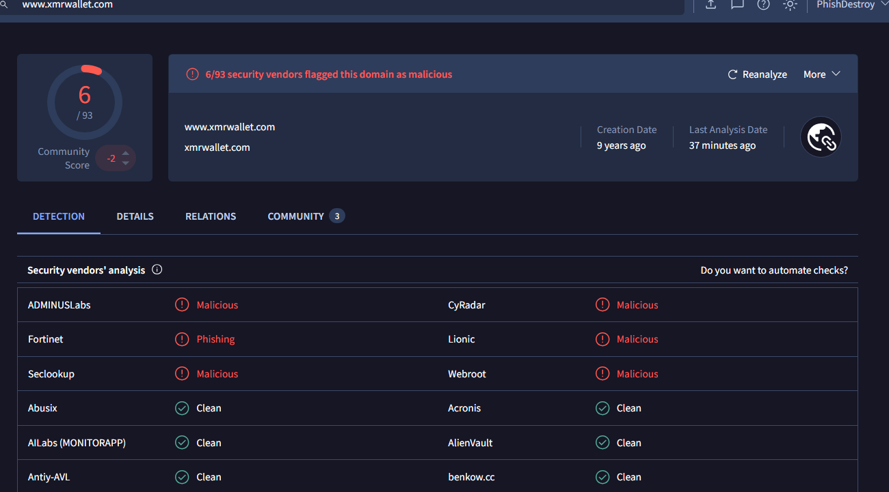
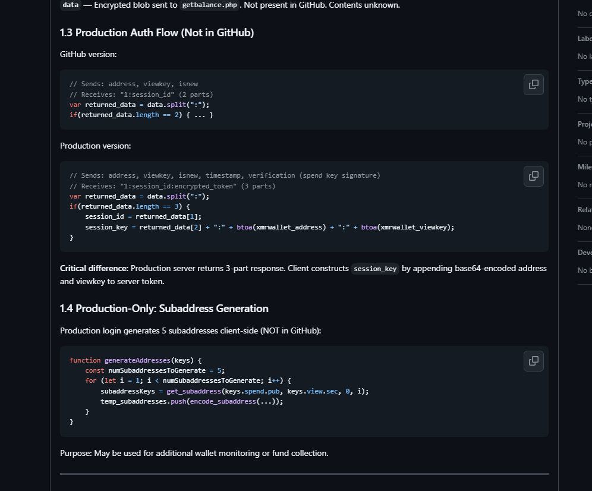
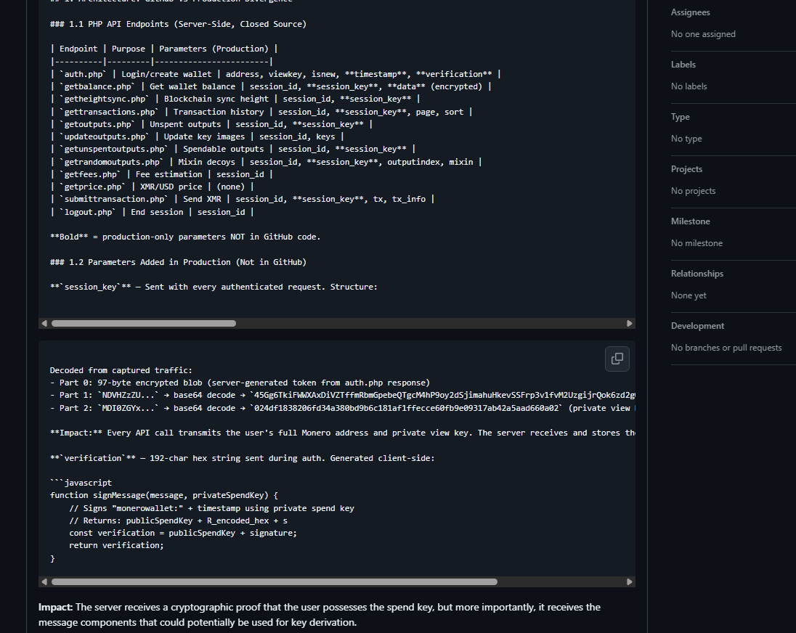
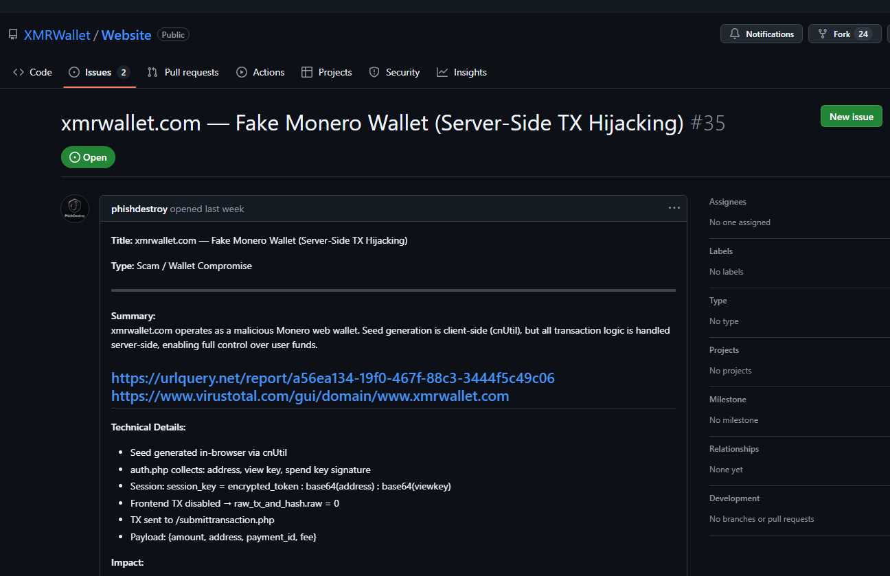

<div align="center">


> **xmrwallet.com · xmrwallet.net · xmrwallet.me — active scam | xmrwallet.cc · xmrwallet.biz — suspended**

# DO-NOT-USE-xmrwallet-com

[](https://github.com/phishdestroy/DO-NOT-USE-xmrwallet-com/stargazers)
[](https://github.com/phishdestroy/DO-NOT-USE-xmrwallet-com/commits/main/)
[](LICENSE)
[](#)
[](#-victim-reports)
[](#-victim-reports)

**Security analysis of xmrwallet.com — confirmed private key exfiltration and server-side transaction hijacking.**
15+ documented victims. $2M+ estimated stolen. Operating since 2016.

[**🌐 Full Evidence Page**](https://phishdestroy.github.io/DO-NOT-USE-xmrwallet-com/) · [**🗑 Deleted Issues Archive**](https://phishdestroy.github.io/DO-NOT-USE-xmrwallet-com/deleted.html) · [**🚨 Report Abuse**](#-report-abuse) · [**✅ Safe Alternatives**](#-safe-alternatives)

[](https://phishdestroy.github.io/DO-NOT-USE-xmrwallet-com/)

</div>

---

---

---

I wonder why the project adds some kind of CAPTCHA — without updating the code on GitHub?  
Can a wallet that runs on the client side really load the system — it should be able to work offline, right? Or not?  

Do you have someone entering lots of wallets? That’s not good!  
You decided to add an ugly CAPTCHA so you only steal targeted ones?
Dude, ask the coder next time to add more comments.  
https://raw.githubusercontent.com/phishdestroy/DO-NOT-USE-xmrwallet-com/refs/heads/master/captchajs.txt
But if you think adding hCaptcha will reduce the number of victims for your phishing — it won’t.  
Open your pockets wider — you always have many victims.  
You just wait and sooner or later someone will refill them.

<p align="center">

</p>

## 🚨 Summary

> **xmrwallet.com transmits your private Monero view key to their server on every API request. Transactions are hijacked server-side. The GitHub repository is a facade — 5.3 years of zero commits while the real theft infrastructure evolved separately.**

| Finding | Status |
|---------|--------|
| Private view key sent to server in plaintext | 🔴 **CONFIRMED** |
| `session_key` encodes viewkey — re-sent 40+ times per session | 🔴 **CONFIRMED** |
| `raw_tx_and_hash.raw = 0` — client TX discarded, server redirects funds | 🔴 **CONFIRMED** |
| 4 Google trackers (GTM, UA, GA4, DoubleClick) inside wallet | 🔴 **CONFIRMED** |
| GitHub repo has 5.3-year commit gap (2018–2024) | 🔴 **CONFIRMED** |
| Operator banned from r/Monero, deleted 21+ GitHub issues | 🔴 **CONFIRMED** |
| 4 escape domains registered — 2 suspended, 2 active (IP recycled) | 🔴 **CONFIRMED** |
| Custom captcha deployed — reverse-engineered and defeated | 🔴 **CONFIRMED** |
| New developer involved — code comments prove second author | 🔴 **CONFIRMED** |
| 50+ paid SEO articles, zero donation wallet | 🔴 **CONFIRMED** |

---

## 🗑 He Deleted the Evidence Instead of Proving He's Innocent

<div align="center">

### On 2026-02-23 the operator silently deleted GitHub Issues #35 and #36

**Instead of proving he's not a thief — he deleted the proof that he is one.**

</div>

---

### 🏃 Escape Domains — Caught, Replaced, Caught Again

The operator purchased **four escape domains**. Two were suspended. Two more were registered 3 days later — reusing the exact same server IPs:

| Domain | Registrar | Prepaid | IP | Status |
|--------|-----------|---------|-----|--------|
| `xmrwallet.cc` | PublicDomainRegistry | 8 years | 185.129.100.248 | ✅ **SUSPENDED** |
| `xmrwallet.biz` | WebNic.cc | 5 years | 190.115.31.40 | ✅ **SUSPENDED** |
| `xmrwallet.net` | NICENIC International | **10 years** | **190.115.31.40** ← same IP as .biz | 🔴 **ACTIVE** |
| `xmrwallet.me` | Key-Systems GmbH | **10 years** | **185.129.100.248** ← same IP as .cc | 🔴 **ACTIVE** |

The operator didn't even change servers — the new domains point to the exact same IPs. Four different registrars used deliberately to slow coordinated takedowns.

**Zero commits were made to the GitHub repository during any domain migration.** No code changes, no config updates, nothing. For a project claiming to be "open source" — switching to new domains without a single public commit says everything.

---

### 🛡 Custom Captcha Deployed — Defeated in Hours

In March 2026, the operator deployed a custom captcha system (proof-of-work + slider puzzle + trajectory tracking) across all active domains. The code reveals a **second developer** — properly commented JavaScript with numbered steps, `// FIX:` annotations, and modern patterns. The original theft code has zero comments.

The captcha was [reverse-engineered and defeated within hours](https://phishdestroy.github.io/DO-NOT-USE-xmrwallet-com/posts/post-xmrwallet-captcha-defeated.html). 100% bypass rate.

---

### 📸 Screenshots captured before deletion

<div align="center">

**Issue #35 — xmrwallet.com: Fake Monero Wallet (Server-Side TX Hijacking)**



> *Full code analysis: `raw_tx_and_hash.raw = 0`, session_key decoded, PHP endpoints, 5.3yr commit gap, operator identity*

---

**Issue #35 — PHP API Endpoints (production vs GitHub divergence)**



> *Production-only parameters `session_key`, `verification`, `data` — none present in the public GitHub repository*

---

**Issue #35 — Production Auth Flow (not in GitHub)**



> *GitHub: 2-part response. Production: 3-part response with `session_key = token : base64(address) : base64(viewkey)`*

---

**VirusTotal — 6/93 security vendors flag xmrwallet.com as malicious**



> *ADMINUSLabs: Malicious · Fortinet: Phishing · CyRadar: Malicious · Lionic: Malicious · Seclookup: Malicious · Webroot: Malicious*

</div>

---

### 🔗 What he can't delete — archived copies

| Archive | Link |
|---------|------|
| **Full archived page** (screenshots, code, decoded keys) | **[phishdestroy.github.io/.../deleted.html](https://phishdestroy.github.io/DO-NOT-USE-xmrwallet-com/deleted.html)** |
| Issue #35 — full cached copy (HTML + CSS + screenshots) | **[cache-issue35](https://phishdestroy.github.io/DO-NOT-USE-xmrwallet-com/cache-issue35/)** |
| Issue #36 — full cached copy (HTML + CSS + screenshots) | **[cache-issue36](https://phishdestroy.github.io/DO-NOT-USE-xmrwallet-com/cache-issue36/)** |
| VirusTotal — 6/93 malicious | [virustotal.com](https://www.virustotal.com/gui/domain/www.xmrwallet.com) |

---

### ❌ 8 years. 21+ deleted issues. Zero rebuttals.

In 8 years of operation the operator has **never once** produced:

| What we asked | What we got |
|---------------|-------------|
| Network capture proving viewkey is NOT sent to server | ❌ Nothing |
| Code proving signed TX IS broadcast (not `raw = 0`) | ❌ Nothing |
| Explanation for `session_key` containing `base64(viewkey)` | ❌ Nothing |
| Explanation for backdoor session `8de50123dab32` | ❌ Nothing |
| Explanation for `swept` TX type (not in Monero) | ❌ Nothing |
| Any technical counter-argument of any kind | ❌ **Nothing. Ever.** |

---

### ⚠️ Consequences

It is unclear why the operator reacted so aggressively — registering escape domains within days, then deleting all evidence after both were suspended. This level of urgency suggests the exposure may lead to consequences the operator did not anticipate.

**Deleting our work does not make it disappear.** Every finding is archived, cached, and reproduced in this repository. For every piece of our research that gets deleted — we will remove a corresponding piece of the fraudulent infrastructure. The `.biz` and `.cc` suspensions were the beginning. The `.net` and `.me` takedowns are next.

---

## 📝 Guest Posts / Articles

| File | Title |
|------|-------|
| [post-xmrwallet-scam-exposed.html](docs/posts/post-xmrwallet-scam-exposed.html) | **xmrwallet.com Scam Exposed** |
| [post-xmrwallet-deleted-evidence.html](docs/posts/post-xmrwallet-deleted-evidence.html) | **Operator Deletes Evidence** |
| [post-is-xmrwallet-safe.html](docs/posts/post-is-xmrwallet-safe.html) | **Is xmrwallet.com Safe? No.** |
| [post-xmrwallet-alternatives.html](docs/posts/post-xmrwallet-alternatives.html) | **Safe Monero Wallets Instead** |
| [post-nathalie-roy-xmrwallet.html](docs/posts/post-nathalie-roy-xmrwallet.html) | **Nathalie Roy: The Operator** |
| [post-xmrwallet-captcha-defeated.html](docs/posts/post-xmrwallet-captcha-defeated.html) | **Captcha Reverse-Engineered and Defeated** |

---

## 📄 PDF Evidence Documents

| File | Description |
|------|-------------|
| [xmrwallet-scam-evidence-report.pdf](docs/pdf/xmrwallet-scam-evidence-report.pdf) | Technical Evidence Report |
| [xmrwallet-deleted-evidence-timeline.pdf](docs/pdf/xmrwallet-deleted-evidence-timeline.pdf) | Deleted Evidence Timeline |
| [xmrwallet-victim-advisory.pdf](docs/pdf/xmrwallet-victim-advisory.pdf) | Victim Advisory |

---

### 🚩 He Will Cry, Threaten, and Lie — Do Not Believe Him

> **The operator will contact you from `royn5094@protonmail.com` or xmrwallet.com email addresses. He will claim innocence, threaten legal action, and play the victim. This is the standard playbook. Do not engage.**

After every exposure, the operator follows the exact same script:

| What he says | The reality |
|--------------|-------------|
| *"I am a volunteer, xmrwallet is free and funded by donations"* | Zero XMR donation wallet exists anywhere. $550+/month hosting, 50+ paid SEO articles, DDoS-Guard CDN — all funded by stolen XMR. |
| *"This is defamation, I will take legal action"* | Has never produced a single technical rebuttal in 8 years. No network capture, no code audit, no evidence of any kind. Threatening researchers instead of proving innocence. |
| *"You used a phishing clone, not the real site"* | Standard deflection to every victim on Trustpilot/Sitejabber. Meanwhile runs identical theft code on 3 domains + Tor. |
| *"It's a sync problem"* | The "sync" works perfectly — it syncs your view key to his server 40+ times per session. The funds were not lost. They were taken. |
| *"Remove this or else..."* | Every threatening email from `royn5094@protonmail.com` is archived. Legal action will result in full publication of all correspondence and escalation of law enforcement referrals. |

**If you receive messages from this operator:**
1. Do not respond
2. Screenshot everything
3. Forward to law enforcement
4. Report to us: [open an issue](https://github.com/phishdestroy/DO-NOT-USE-xmrwallet-com/issues)

The operator has had 8 years to prove he's not a thief. He chose deletion every single time.

---

### 📅 Timeline

```
2016-08-29  xmrwallet.com  registered — primary scam domain
2026-02-04  xmrwallet.cc   registered secretly — 8yr prepaid
2026-02-09  xmrwallet.biz  registered secretly — 5yr prepaid
2026-02-13  Issue #35 published — TX hijacking mechanism exposed
2026-02-18  Issue #36 published — live network capture, 43 viewkey transmissions
2026-02-23  xmrwallet.cc   SUSPENDED by registrar
2026-02-23  xmrwallet.biz  SUSPENDED by registrar
2026-02-23  Operator deletes Issues #35 + #36. No rebuttal. Just deletion.
2026-02-26  xmrwallet.net  registered — 10yr prepaid, same IP as .biz (190.115.31.40)
2026-02-26  xmrwallet.me   registered — 10yr prepaid, same IP as .cc (185.129.100.248)
2026-03     Custom captcha deployed — reverse-engineered and defeated in hours
```

---

## 🔍 Technical Evidence

### 1. View Key Exfiltration

Every session starts with a POST to `/auth.php` — your private view key transmitted in plaintext:

```
// POST https://www.xmrwallet.com/auth.php
address = 46EkQdF7iQ4i4Ah935SipgXbDSryh5...
viewkey = efba13ecb8b360660a3dcaafaf7cf99149713d064b9d64997b2454d58ee67800
```

The server returns `session_key` — not a random token, but your address + viewkey encoded in Base64:

```
session_key = [blob]:[base64(address)]:[base64(viewkey)]

python3 -c "import base64; print(base64.b64decode('ZWZiYTEzZWNiOGIzNjA2NjBhM2RjYWFmYWY3Y2Y5OTE0OTcxM2QwNjRiOWQ2NDk5N2IyNDU0ZDU4ZWU2NzgwMA==').decode())"
# OUTPUT: efba13ecb8b360660a3dcaafaf7cf99149713d064b9d64997b2454d58ee67800
#                                          ^^^ YOUR PRIVATE VIEW KEY ^^^
```

This `session_key` is re-sent to the server on **every single request** — 40+ times per session:

```
POST /getheightsync.php     viewkey  ×12
POST /gettransactions.php   viewkey  ×10
POST /getbalance.php        viewkey  ×6
POST /getsubaddresses.php   viewkey  ×4
POST /support_login.html    viewkey  session_id=8de50123dab32  ← BACKDOOR
```

### 2. Transaction Hijacking

```javascript
raw_tx_and_hash.raw = 0       // client TX discarded, never broadcast

if(type == 'swept') {         // server-initiated theft marker
  txid = 'Unknown transaction id'  // obfuscated in UI
}
```

The client builds a transaction — then discards it. Only metadata goes to the server, which constructs its own transaction and can redirect funds to **any address**.

### 3. Hidden Production Logic

Not present anywhere in the public GitHub repository:

- `session_key` parameter
- `verification` field
- encrypted `data` payload
- `/support_login.html` backdoor endpoint

Auditing the GitHub repo is useless — production code differs fundamentally.

### 4. Google Tag Manager Abuse

GTM loads arbitrary JavaScript from Google's servers. The operator can push new code — including key exfiltration scripts — to all users **without changing a single line on GitHub**.

```
GET googletagmanager.com/gtm.js   ×12  — loads arbitrary JS
GET google-analytics.com          ×12  — UA-116766241-1
GET analytics.google.com/g/collect ×5  — GA4
GET stats.g.doubleclick.net        ×1  — ad tracker
```

---

## 🕵️ Operator Profile

| Attribute | Value |
|-----------|-------|
| **GitHub** | [nathroy](https://github.com/nathroy) (ID: 39167759) |
| **Email** | admin@xmrwallet.com · support@ · feedback@ |
| **Reddit** | u/WiseSolution — **banned from r/Monero** |
| **Twitter** | @xmrwalletcom |
| **GitHub org created** | 2018-05-10 |
| **Commit gap** | **2018-11-06 → 2024-03-15 (5.3 years — ZERO commits)** |
| **Domain paid until** | 2031 (registered 2016) |

### GitHub Commit Timeline

```
2018-05-10  v1 First release          ← looks open-source
2018-11-06  Bulletproof Update        ← last real commit

   2018 ————————————————————————————————— 2024   ZERO COMMITS (5.3 YEARS)
   ↑ Production actively updated. session_key added. Theft infrastructure evolved.
   ↑ Wayback Machine 2023: ZERO references to session_key in archived pages.

2024-03-15  v0.18.0.0 "2024 updates"  ← sanitized dump, PHP backend excluded
current     v0.18.4.1 production      ← additional changes NOT in GitHub
```

### Cover-Up Pattern

- Banned from r/Monero after self-promotion in 2018
- GitHub Issue #13 deleted by repository owner
- Standard theft deflection: *"sync problem — try Monero CLI"* (funds already gone)
- 50+ paid/sponsored articles on crypto media — PhishDestroy contacted all publishers, majority removed them
- 100+ blog posts, 10 languages, DDoS-Guard CDN, Android app, active Trustpilot management
- **Zero donation wallet address** — claimed "volunteer project" funded by no one

> A volunteer open-source project does not bulk-purchase sponsored articles. With no donation wallet, the money comes from stolen XMR.

---

## 👥 Victim Reports

| Amount | Source | Notes |
|--------|--------|-------|
| **590 XMR** (~$177,000) | Sitejabber | *"deposited 590 monero — 2 days gone"* |
| **17.44 XMR** | Trustpilot | TxID & TX Key documented |
| Unknown | Trustpilot | *"transferred to some other wallet instead of mine"* |
| **$200** | Trustpilot | *"stole $200, leaving me high and dry"* |
| **20 XMR** | Sitejabber | *"put 20 xmr — next day 0 xmr"* |
| Unknown | Trustpilot | *"cannot verify transaction using private viewing key"* |

> Conservative estimate: **10,000–50,000+ wallets created** over 8 years. Total stolen: **5,000–50,000+ XMR** ($1.5M–$15M+ at historical prices).

---

## 🌐 Infrastructure IOCs

| Type | Value | Notes |
|------|-------|-------|
| Domain | `xmrwallet.com` | NameSilo, paid until 2031 |
| Domain | `xmrwallet.net` | NICENIC, paid until 2036 — **ACTIVE** |
| Domain | `xmrwallet.me` | Key-Systems, paid until 2036 — **ACTIVE** |
| Domain | `xmrwallet.cc` | **SUSPENDED** by PDR |
| Domain | `xmrwallet.biz` | **SUSPENDED** by WebNic |
| Tor v3 | `xmrtor3fsapuu6y26za7vpzox4vpaj6ny5viq2arbmozm7kg6jitnlid.onion` | Active |
| IP | `186.2.165.49` | xmrwallet.com — AS59692 IQWeb |
| IP | `190.115.31.40` | xmrwallet.net (recycled from .biz) — AS59692 IQWeb |
| IP | `185.129.100.248` | xmrwallet.me (recycled from .cc) — AS57724 DDoS-Guard |
| MX | `mx1/mx2.privateemail.com` | Same across all 5 domains |
| NS | `ns1/ns2.ddos-guard.net` | Same across all 5 domains |
| Cookies | `__ddg8_` `__ddg9_` `__ddg10_` `__ddg1_` | DDoS-Guard tracking |
| Analytics | `UA-116766241-1` | Google Analytics |
| session_key | `[blob]:[b64_address]:[b64_viewkey]` | **Key exfiltration vector** |
| TX marker | `type == 'swept'` | Server-initiated theft |
| Backdoor | `/support_login.html` `session_id=8de50123dab32` | Not user-initiated |

### External Threat Intelligence

[](https://www.virustotal.com/gui/domain/www.xmrwallet.com)
[](https://urlquery.net/report/a56ea134-19f0-467f-88c3-3444f5c49c06)
[](https://www.scamadviser.com/check-website/xmrwallet.com)

---

## 📢 Report Abuse

<div align="center">

| Platform | Link |
|----------|------|
| FBI IC3 | [ic3.gov](https://ic3.gov) |
| FTC | [reportfraud.ftc.gov](https://reportfraud.ftc.gov) |
| Action Fraud | [actionfraud.police.uk](https://www.actionfraud.police.uk) |
| CAFC | [antifraudcentre.ca](https://www.antifraudcentre-centreantifraude.ca) |
| Interpol | [interpol.int/Crimes/Cybercrime](https://www.interpol.int/Crimes/Cybercrime) |
| Google Safe Browsing | [report_phish](https://safebrowsing.google.com/safebrowsing/report_phish/) |
| Netcraft | [report.netcraft.com](https://report.netcraft.com) |
| VirusTotal | [virustotal.com](https://www.virustotal.com/gui/domain/xmrwallet.com) |
| Registrar (.com) | abuse@namesilo.com |
| Registrar (.net) | abuse@nicenic.net |
| Registrar (.me) | abuse@key-systems.net |
| Hosting | abuse@ddos-guard.net |

</div>

---

## ✅ Safe Alternatives

| Wallet | Platform | Link |
|--------|----------|------|
| **Monero GUI** | Desktop (Official) | [getmonero.org/downloads](https://getmonero.org/downloads) |
| **Feather Wallet** | Desktop | [featherwallet.org](https://featherwallet.org) |
| **Monerujo** | Android | [monerujo.io](https://monerujo.io) |
| **Cake Wallet** | iOS / Android | [cakewallet.com](https://cakewallet.com) |

> **Never use a web wallet that asks for your private key or seed phrase.**

---

## 🔗 Related Projects

| Project | Description | Stars |
|---------|-------------|-------|
| [**destroylist**](https://github.com/phishdestroy/destroylist) | 70,000+ malicious domain blocklist |  |
| [**ScamIntelLogs**](https://github.com/phishdestroy/ScamIntelLogs) | Intel archive of crypto scam operations |  |

---

## 📡 Connect

<div align="center">

[](https://phishdestroy.io)
[](https://t.me/destroy_phish)
[](https://t.me/PhishDestroy_bot)
[](https://x.com/Phish_Destroy)
[](https://api.destroy.tools)

</div>

---

## ⚠️ Disclaimer

This repository contains evidence of criminal activity published for research, public safety, and law enforcement purposes. Data is provided as-is based on observed behavior and publicly available analysis. Independent verification recommended.

---

<div align="center">

**Scammers delete evidence. We preserve it.**

*PhishDestroy — [phishdestroy.io](https://phishdestroy.io)*

</div>
